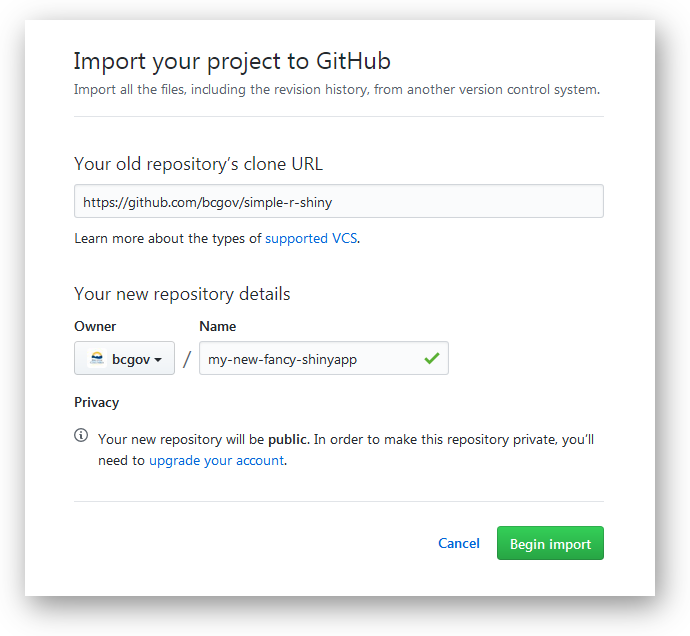

# Shiny Server Development Template

## Introduction

This repo is intended to be forked and used as a development repo for R applications that use [Shiny](http://shiny.rstudio.com/) as a visualization server.  The code is designed to run locally in development using Docker, and can be productionized using your github repo through OpenShift.

### Where do I put my code?

All of your code goes into the `app` directory. Data goes into the `app/data` directory and web resources such as css and images go into `app/www` directory. If you need to write data to the server, ensure that the data gets written to the `output` folder as shown [here](https://github.com/bcgov/simple-R-shiny/blob/master/app/app.R#L52).
If you have a README for your project, please also put it here.  Your Shiny code can go into one file (`app.R`) as per the example, or you can split it into seperate `ui.R` and `server.R` files as you wish.

To keep the shiny app as lightweight as possible, don't put anything extra or unnecesary into the `app` directory.

## Getting Started

There are several steps you must complete in order to begin:

### 1. Install Docker

Instructions for installing docker on your local OS are [provided here](https://docs.docker.com/engine/installation/ "Yeah! Install Docker").

While not directly related to this project, there is a tutorial on using Docker with R [here](http://ropenscilabs.github.io/r-docker-tutorial/), which you may find helpful.

### 2. Fork this repo and clone to your machine

This repo is already set up to work with Docker and Openshift, so it is simplest to fork this repo into your own, and thereby take advatage of any future changes to the tools provided.
Instructions for forking into your own github repo are [provided here](https://help.github.com/articles/fork-a-repo/ "Fork Repo in Github").

You next need to clone the new repo onto your local machine so that you can start entering your code and developing.  There are many graphical tools available that can help manage this, some of which can be found [here](https://git-scm.com/download/gui/linux "Github GUI").  Or you can simply use the command line, instructions for which can be found [here](https://git-scm.com/book/en/v2/Git-Basics-Getting-a-Git-Repository "git command line").

#### Forking within the **bcgov** GitHub organization:

If you want to fork the repo *within* the **bcgov** organization, you can't use GitHub's forking feature, however you can achive the same result with a few simple steps:

1. Go to the [Import Repository](https://github.com/new/import) page on GitHub. In the *'Old Repository URL'* field, put the url of this repository (`https://github.com/bcgov/simple-r-shiny`). Set the *Owner* to **bcgov**, and choose a unique name (say, 'my-new-fancy-shinyapp'). Click **Begin Import** and a new repository will be created at **github.com/bcgov/my-new-fancy-shinyapp** based on **github.com/bcgov/bcgov/simple-R-shiny**:



2. Using the command line, clone your new repository to your computer:
```sh
$ git clone https://github.com/bcgov/my-new-fancy-shinyapp
```

3. Next you need to establish a link between your new repo and this repo, so that if anything changes in the **bcgov/simple-R-shiny** repo you can pull those changes in easily. You do this be setting **bcgov/simple-R-shiny** as new remote called `upstream` (based on instructions [here](https://help.github.com/articles/configuring-a-remote-for-a-fork/)):

    i. Make sure you are in the new repo folder:
      ```sh
      $ cd my-new-fancy-shinyapp
      ```

    ii. List current remotes (probably just 'origin' pointing to `github.com/bcgov/my-new-fancy-shinyapp`)
      ```sh
      $ git remote -v
      ```

    iii. Add **bcgov/simple-r-shiny** as a remote called `upstream` and verify it has been created properly:
      ```sh
      $ git remote add upstream https://github.com/bcgov/simple-r-shiny
      $ git remote -v
      ```

4. To get updates in your repo from the *upstream* **bcgov/simple-r-shiny** repo, follow these instructions on [syncing a fork](https://help.github.com/articles/syncing-a-fork/).

### 3. Edit the packages.txt file

The packages.txt file contains an array of strings that indicate the packages you will be using in your R program.  This list is used when building your local Dockerfile so that the build process runs as fast as possible.  If you are familiar with Docker you know that you can also set environment variables that import this information, however this prevents the build process from using the cached layer for this step.  Therefore the packages.txt file is used to build an explicit local Dockerfile that ensures fast repeated builds.

The packages.txt file should look something like this (package names separated by a space, no quotation marks):
```
package1 package2 package3
```
with all packages on the same line.

Do not include 'shiny' or 'rmarkdown' in packages.txt as they are installed automatically.

### 4. Edit the system-libraries.txt file

If any of the R packages you need to install require special system libraries (to be installed with `apt-get install`; eg. `libgdal-dev` and `libproj-dev` for the [`rgdal`](https://cran.rstudio.com/web/packages/rgdal/) package, or `libxml2-dev` for the [`xml2`](https://cran.rstudio.com/web/packages/xml2/) package), list them in this file. It works similarly to packages.txt to build an explicit local Dockerfile that ensures fast repeated builds.

The system-libraries.txt should look something like this (libraries separated by a space, no quotation marks):

```
lib1 lib2
```

### 5. GitHub-hosted Packages

Many times you will build a Shiny App that requires R Packages (or versions) that are only available from GitHub. These are installed using `devtools::install_github`. List them in the `gh-packages.txt` file, 
as space-separated strings made up of the GitHub user/organization and repository name. 
It's also recommended to specify a the `SHA` of a specific commit or release tag. 

The file should look something like this (separated by a space, no quotation marks):

```
ropensci/plotly@a1613b3e225 tidyverse/ggplot2@v2.2.1
```

### 6. Run / Develop

With all your packages listed in the packages.txt file, and your code in the app directory you should be able to run `./dev.sh` at the command line (on Windows use the *Docker Quickstart Terminal*) in the root of your project to initiate Docker.

```
$ ./dev.sh
```

This command will build a local Dockerfile and run it for you.  All of your code will be added to the container and run.  Especially important is that new directories will appear in the root of your project under the '_mount' directory:

- **_mount/bookmarks** : This is where shiny will write its bookmarks
- **_mount/logs**      : Pretty much what you  might expect
- **_mount/output**    : In your program, if you write to '/srv/shiny-server-output' it will show up here
- **_mount/tmp**       : The /tmp directory if you need to debug the temporary files created by shiny

**Note to Windows users:** If you are on Windows and using Docker with VirtualBox, it unfortunately won't be able to mount the logs and bookmarks folders locally (i.e., `_mount` directory won't be created), but it will build and lanch the app.

The first time you run dev.sh you will see a lot of output where docker is building the container image for the first time and installing all the dependencies.
On each successive run as you modify your code and run dev.sh, you will see that only your new code gets placed into the image and run.  If you add new packages *do not forget to update the packages.txt file* or you will see the missing packages errors in your R program logs.

If you want to rebuild the image from scratch, you can run:

```
$ ./dev.sh --no-cache
```

and the `docker build` command will run with the `--no-cache` flag. You might also want to first delete `.packages.txt`, `.gh-packages.txt`, `.system-libraries.txt`, and `Dockerfile.local` to ensure everything runs smoothly.

#### Troubleshooting

1. If the Docker image builds properly but the app isn't working as expected, sometimes it is necessary to enter the running Docker container to see what's going on. You will first need to get the id of the running container:

Run the following to get a list of running containers:
```
$ docker ps
```

Copy the `ID` of the container, then run: 

```
$ docker exec -it [your container id] bash
```

This will drop you into a bash shell so you can poke around in the container.

2. If you're running this in **Docker Toolbox** for Windows, you may get a cryptic error that looks like this:

```
Running Shiny App...
standard_init_linux.go:175: exec user process caused "no such file or directory"
```

This is likely because `tools/run-server.sh` has Windows line-endings (`\r\n`) instead of Unix line-endings (`\n`). You can use the `dos2unix` command-line tool to fix this:

```sh
$ dos2unix tools/run-server.sh
```

## Deploying to OpenShift the first time.

You will first need a project set up in OpenShift - you will need an OpenShift administrator to do this for you.

### Creating a new app from the OpenShift Web Console

1. Open your project in the OpenShift Web Console

2. Click 'Add to Project'

3. Search for "shiny" in the search box, and click on the "shiny-server" template

4. Fill in the parameter fields, replacing the defaults if required.
    
    Fields you will definitely need to edit: 
      - Name (what you want to call it)
      - Git Repository URL (the GitHub repository where your dockerized app is hosted)
      - R Packages (same as `packages.txt`)
      - System Libraries (same as `system-libraries.txt`)
      - R GitHub Packages (same as `gh-pacakges.txt`)

5. Add some [labels](https://docs.openshift.com/container-platform/3.4/dev_guide/application_lifecycle/new_app.html#specifying-labels), at least one, to be able to uniquely identify all of the components of your app.
 
6. Click Create. Your app should build and deploy.

### Creating a new app using Command Line Tools

*An introduction to the OpenShift command line tools is [here](https://docs.openshift.com/container-platform/3.3/cli_reference/index.html)*

- First, ensure you are in the project in which you want your app to appear:

```
$ oc project shiny-server
```

- Create a new app with `oc new-app`. (Generic instructions for creating an app are [here](https://docs.openshift.com/container-platform/3.3/dev_guide/application_lifecycle/new_app.html#dev-guide-new-app))

- Specify that you want to use the `shiny-server` template with `--template="shiny-server"`

- Set parameters with the `--param` argument. You can list the parameters that you can override with:
    ```
    $ oc process --parameters -n openshift shiny-server
    ```

    You will want to set:
      - `NAME` (what you want to call it)
      - `SOURCE_REPOSITORY_URL` (the GitHub repository where your dockerized app is hosted)
      - `R_PACKAGES` (same as `packages.txt`)
      - `SYS_LIBRARIES` (same as `system-libraries.txt`)
      - `R_GH_PACKAGES` (same as `gh-pacakges.txt`)


- Add [labels](https://docs.openshift.com/container-platform/3.3/dev_guide/application_lifecycle/new_app.html#specifying-labels) with the `-l` flag. Set at least one, to be able to uniquely identify all of the components of your app.

- Although you are (probably) already in the project in which you want the app to appear, it's a good idea to specify the project's namespace with `-n my-project`

Example:

```
$ oc new-app --template="shiny-server" --param NAME="rshiny-test" --param SOURCE_REPOSITORY_URL="https://github.com/bcgov/simple-R-shiny" --param R_PACKAGES="ggplot2 dplyr" --param R_GH_PACKAGES="ropensci/plotly@a1613b3e225" -l id=rshiny-test -n shiny-server
```

This may fail the first time due to a [known issue](https://github.com/openshift/origin/issues/4518). If you start another build it should work:

```
$ oc start-build rshiny-test -n shiny-server
```

## Updating the app in OpenShift (after it's been created)

If you push modifications of your app to GitHub, updating it in OpenShift is as simple as starting a new build. On the command line it is:

```
$ oc start-build rshiny-test -n shiny-server
```

Or click the 'Start Build' button in the OpenShift Web Console 'Builds' section.
